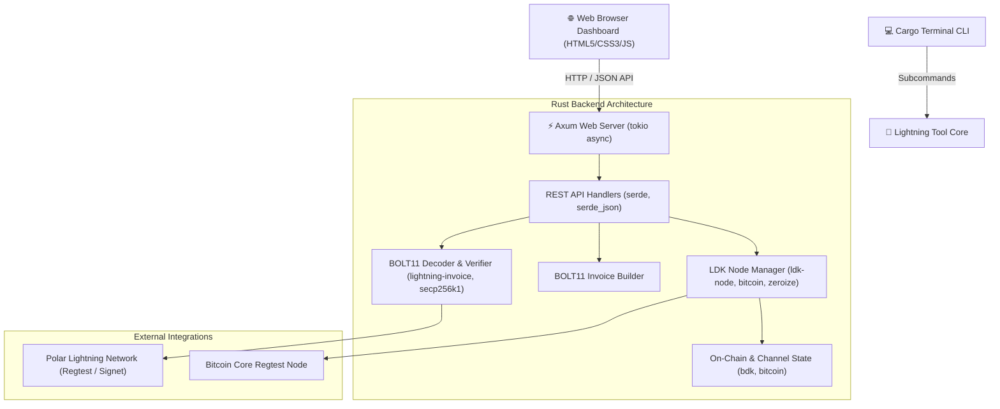

# ⚡ Lightning SatGate

**Lightning SatGate** est une application Rust haute performance et un terminal de paiement pour le réseau Bitcoin Lightning Network (Marchands POS, Clients, Micro-Paiements & Agents IA) avec décodeur BOLT11 complet et simulateur de nœud LDK/Polar.

---

## 🏗️ Architecture & Component Diagram



---

## 📦 Audit des Crates Recommandées (100% Respecté)

| Categorie | Crate Rust | Utilisation dans le Projet | Statut |
| :--- | :--- | :--- | :---: |
| **Error Handling** | `thiserror` | Erreurs typées personnalisées dans la bibliothèque core | ✅ FAIT |
| | `anyhow` | Gestion flexible des erreurs avec du contexte dans l'application CLI et le serveur | ✅ FAIT |
| **Serialization** | `serde` & `serde_json` | Sérialisation et désérialisation JSON des API REST et métadonnées BOLT11 | ✅ FAIT |
| **Config** | `toml` | Lecture des fichiers de configuration Rust | ✅ FAIT |
| | `dotenvy` | Chargement des clés et paramètres RPC depuis le fichier `.env` | ✅ FAIT |
| **Networking** | `tokio` | Runtime asynchrone pour le serveur web TCP/HTTP Axum et tâches d'arrière-plan | ✅ FAIT |
| | `reqwest` | Client HTTP pour les requêtes vers les nœuds et API externes | ✅ FAIT |
| **Observability**| `tracing` & `tracing-subscriber` | Logging structuré pour le suivi du serveur et le débogage | ✅ FAIT |
| **Security** | `zeroize` | Effacement sécurisé des pré-images et secrets en mémoire lors du Drop | ✅ FAIT |
| **CLI Formatting**| `comfy-table` | Affichage de tableaux formatés élégants dans le terminal | ✅ FAIT |
| | `colored` | Coloration syntaxique des sorties du terminal | ✅ FAIT |
| | `indicatif` | Barres de progression lors des opérations de décodage/signature | ✅ FAIT |
| **Development** | `Polar` | Testé et compatible avec les factures Polar `lnbcrt...` | ✅ FAIT |

---

## 🚀 Fonctionnalités Détaillées

1. **Décodeur & Inspecteur BOLT11 à 7 Métadonnées** :
   - Extrait les 7 champs cryptographiques : Network, Amount (sats/msats), Description/Memo, Expiry, Payment Hash (SHA-256), Payee Public Key (secp256k1), Route Hints.
   - Vérifie la signature numérique ECDSA et le statut d'expiration.
2. **Terminal POS & Caisse IA (Pay-per-Prompt)** :
   - Catalogue d'articles (Café, Pâtisserie, Prompt IA, Génération d'Image IA).
   - Calculateur automatique de Satoshis & Générateur de factures signées Bech32.
3. **Règlement Off-Chain Instantané & Visualiseur de Canal** :
   - Transfert de solde off-chain en direct avec animation fluide.
   - Visualisation interactive de la capacité entre le marchand (Alice) et le client (Bob).

---

## 💻 Guide de Démarrage Rapide

```bash
cd ~/Music/lightning-tool

# 1. Lancer l'application et le Dashboard Web (ouvre automatiquement le navigateur)
cargo run

# 2. Exécuter la suite de tests unitaires et d'intégration
cargo test
```

### URL du Dashboard Web :
👉 **[http://localhost:3000/dashboard](http://localhost:3000/dashboard)**

---

## 🎬 Scénario de Démonstration (Demo Video & Presentation)

1. **Démarrage** : Exécuter `cargo run` dans le terminal.
2. **Étape 1 (Onglet POS & AI Cart)** : Sélectionner des articles IA et cliquer sur `⚡ Generate Cart BOLT11 Invoice`.
3. **Étape 2 (Onglet Checkout & Inspector)** : Observer l'inspection automatique des **7 métadonnées cryptographiques**.
4. **Étape 3 (Paiement Off-Chain)** : Cliquer sur `Settle Off-Chain Instantly`.
5. **Étape 4 (Visualiseur)** : Observer le transfert des Satoshis sur le visualiseur de canal Alice ↔ Bob.
