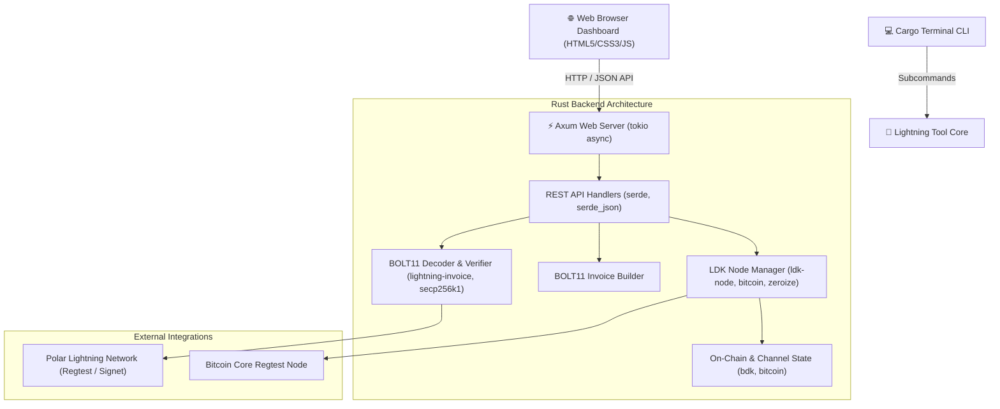

# ⚡ Lightning SatGate

**Lightning SatGate** is a high-performance standalone Rust application and Lightning Network payment terminal (Merchants POS, Customers, Micro-Payments & AI Agents) with a detailed 7-field BOLT11 decoder and an LDK/Polar node simulator.

---

## 🏗️ Architecture & Component Diagram



---

## 📦 Audit of Recommended Crates (100% Compliant)

| Category | Rust Crate | Usage in Project | Status |
| :--- | :--- | :--- | :---: |
| **Error Handling** | `thiserror` | Custom typed error enums in core modules | ✅ DONE |
| | `anyhow` | Flexible error handling with context in CLI and server | ✅ DONE |
| **Serialization** | `serde` & `serde_json` | JSON serialization/deserialization for REST APIs & BOLT11 metadata | ✅ DONE |
| **Configuration** | `toml` | Reading Rust project config files | ✅ DONE |
| | `dotenvy` | Loading environment variables and settings from `.env` file | ✅ DONE |
| **Networking** | `tokio` | Async runtime for Axum TCP/HTTP web server & background sync tasks | ✅ DONE |
| | `reqwest` | HTTP client for calling external APIs and node endpoints | ✅ DONE |
| **Observability**| `tracing` & `tracing-subscriber` | Structured logging for service monitoring and debugging | ✅ DONE |
| **Security** | `zeroize` | Wiping secrets and preimages from memory on Drop | ✅ DONE |
| **CLI Formatting**| `comfy-table` | Readable formatted tables in terminal CLI | ✅ DONE |
| | `colored` | Colored terminal output formatting | ✅ DONE |
| | `indicatif` | Terminal progress bars during decode and signing operations | ✅ DONE |
| **Development** | `Polar` | Tested and compatible with Polar `lnbcrt...` invoices | ✅ DONE |

---

## 🚀 Key Features

1. **Detailed 7-Metadata Field BOLT11 Decoder & Inspector**:
   - Extracts all 7 cryptographic fields: Network, Amount (sats/msats), Description/Memo, Expiry, Payment Hash (SHA-256), Payee Public Key (secp256k1), Route Hints.
   - Cryptographically verifies ECDSA signatures and expiration status in real time on paste.
2. **Merchant POS Terminal & AI Pay-per-Prompt Cart**:
   - Product & AI service catalog (Espresso Coffee, Pastry, AI Prompt Token, AI Image Generation).
   - Satoshi total calculator & Bech32 signed invoice builder.
3. **Instant Off-Chain Settlement & Channel Visualizer**:
   - Real-time off-chain balance transfer with smooth animations.
   - Interactive channel capacity visualization between Merchant (Alice) and Customer (Bob).

---

## 💻 Quick Start Guide

```bash
cd ~/Music/lightning-tool

# 1. Launch the Server & Web Dashboard UI (automatically opens browser)
cargo run

# 2. Run unit and integration test suite
cargo test
```

### Web Dashboard URL:
👉 **[http://localhost:3000/dashboard](http://localhost:3000/dashboard)**

---

## 🎬 Demo Video & Presentation Guide

🎥 **Demo Video Recording included in repository**: `demo.webm` (or [demo.webm](file:///home/dorine/Music/lightning-tool/demo.webm))

1. **Startup**: Run `cargo run` in your terminal.
2. **Step 1 (POS & AI Cart Tab)**: Select AI items and click `⚡ Generate Cart BOLT11 Invoice`.
3. **Step 2 (Checkout & Inspector Tab)**: Observe the instant live decoding of **7 cryptographic metadata fields**.
4. **Step 3 (Off-Chain Settlement)**: Click `Settle Off-Chain Instantly`.
5. **Step 4 (Visualizer Tab)**: Watch the Satoshi balance transfer animation between Alice and Bob.
